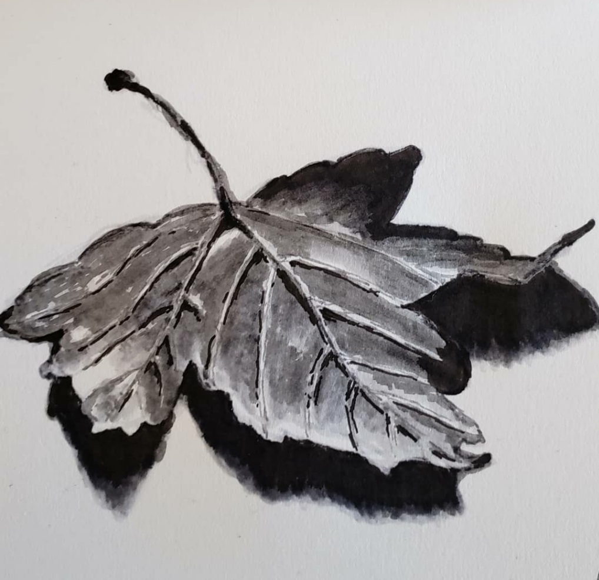
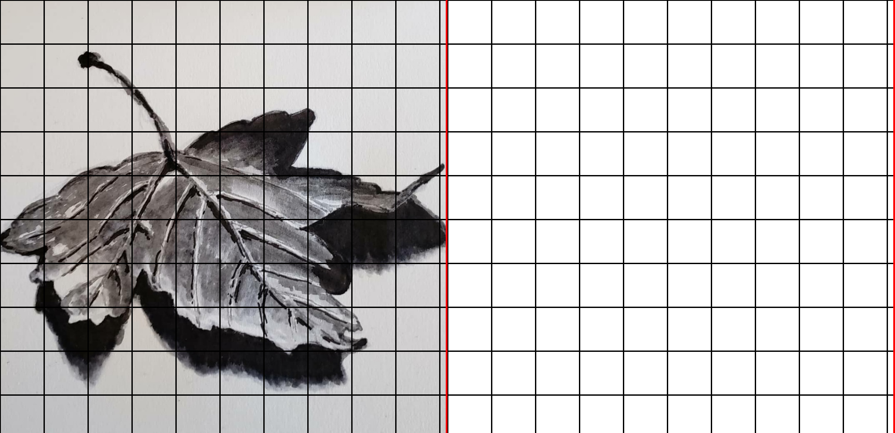

## What it does

Take in an image, add a grid layout and create an empty grid on the right side which can be used to grid-copy the image.

## Usage

```
$ ./grid-copy.py --help
usage: grid-copy.py [-h] input_image [grid_size] [output_image]

Convert image to grid-copy-able image

positional arguments:
  input_image   Path to the input image
  grid_size     Size of the grid cells; default: 100
  output_image  Path to save the output image; default: out.png

options:
  -h, --help    show this help message and exit
```

## Example

```
$ ./grid-copy.py samples/leaf.png
Image saved to out.png
```

### Input



### Output


